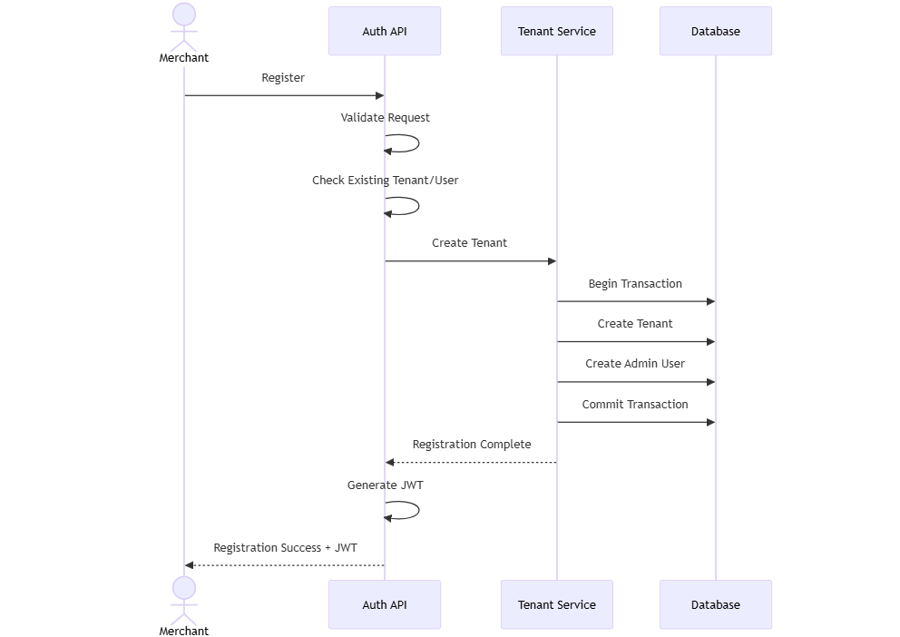
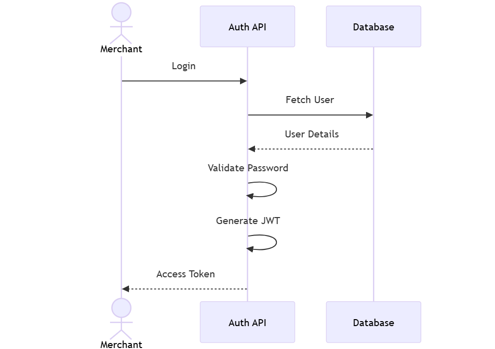
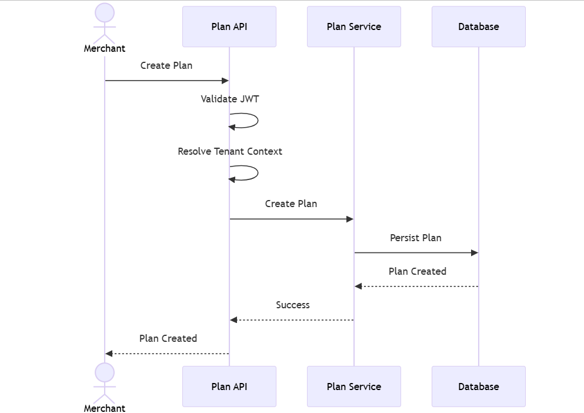
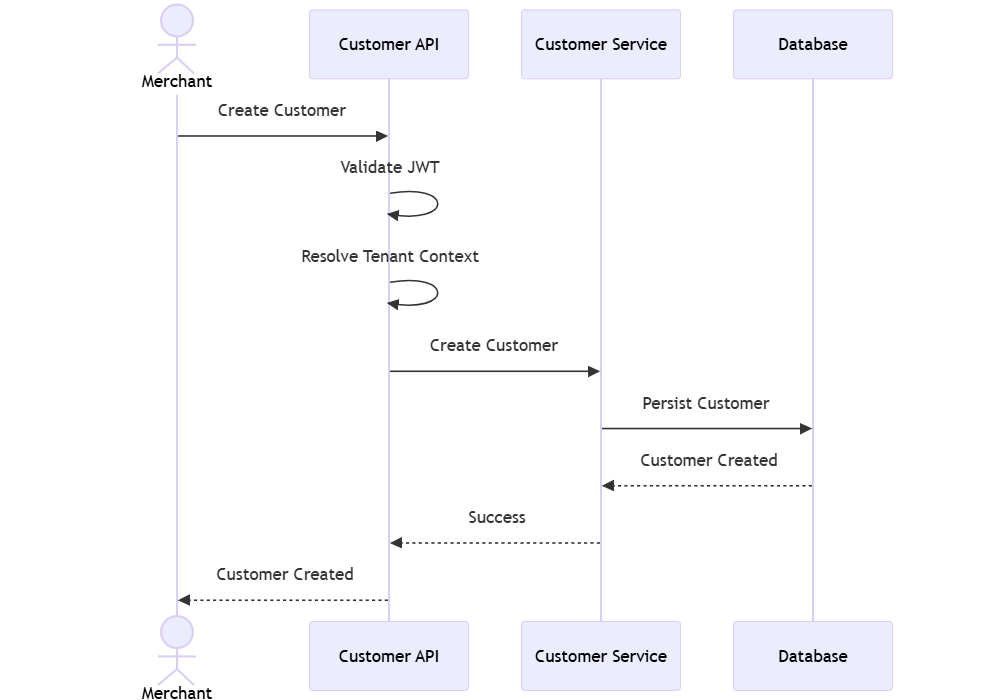
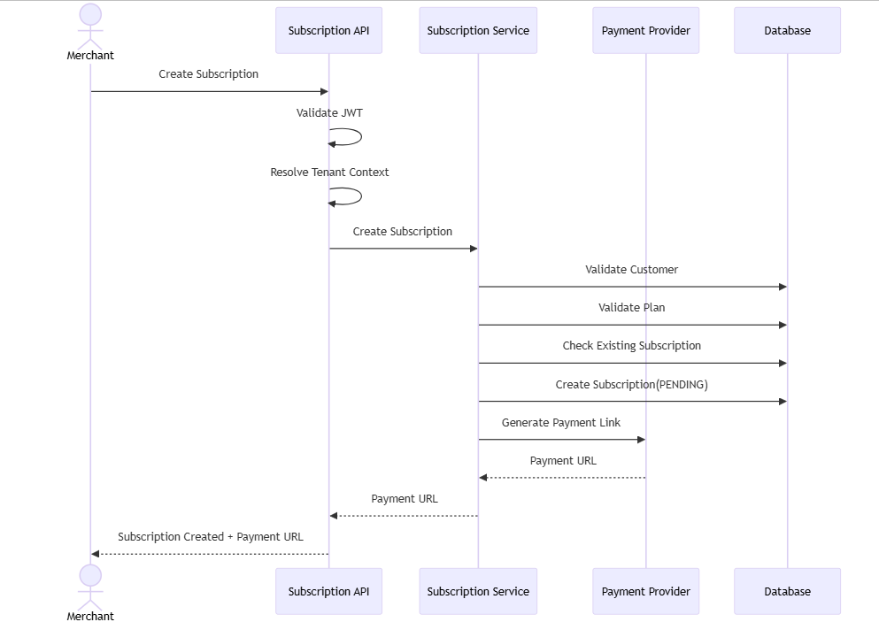
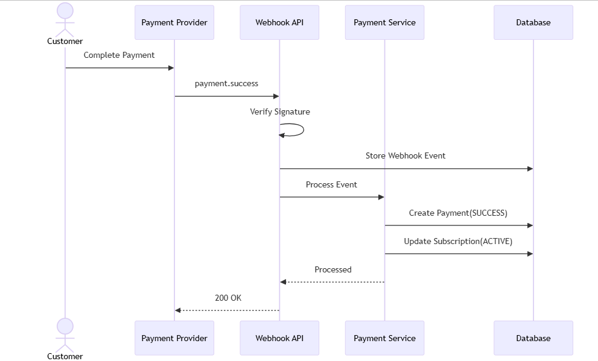
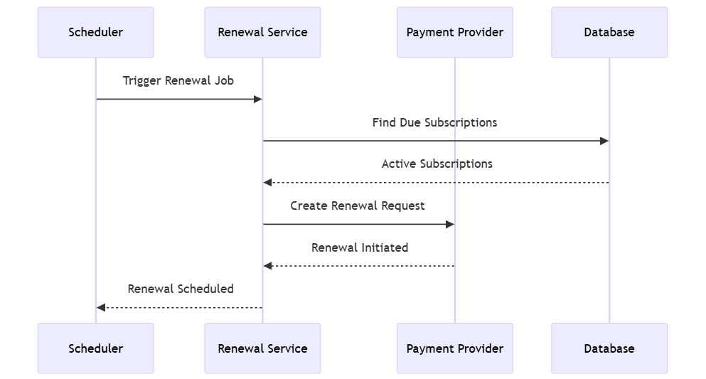
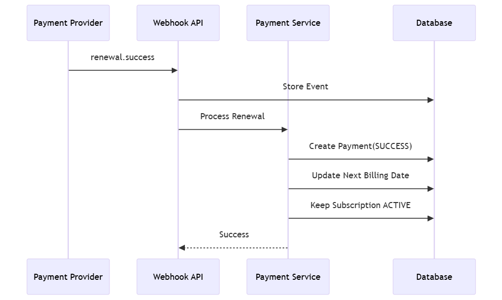
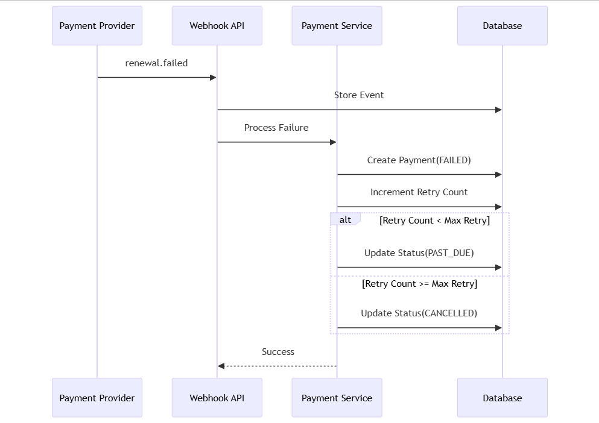

# Sequence Diagrams

## Overview

This document defines the core business workflows of the SMB Subscription Platform.

The MVP supports six primary flows:

1. Tenant Registration
2. Tenant Login
3. Plan Creation
4. Customer Creation
5. Subscription Creation
6. Subscription Renewal

---

# Flow 1 - Tenant Registration

## Goal

A merchant registers on the platform and becomes a Tenant.

## Sequence

## Outcome

* Tenant created
* Admin user created
* JWT issued

---

# Flow 2 - Tenant Login

## Goal

Authenticate an existing Tenant User.

## Sequence

## Outcome

* User authenticated
* JWT issued
* Tenant context established

---

# Flow 3 - Plan Creation

## Goal

Tenant creates a subscription plan.

## Sequence

## Outcome

* Plan created
* Plan linked to Tenant

---

# Flow 4 - Customer Creation

## Goal

Tenant creates a customer.

## Sequence

## Outcome

* Customer created
* Customer linked to Tenant

---

# Flow 5 - Subscription Creation

## Goal

Tenant creates a subscription for a customer and generates a payment request.

## Preconditions

* Customer exists
* Plan exists
* Customer has no existing subscription

## Sequence

## Outcome

* Subscription created
* Subscription status = PENDING
* Payment link generated

---

# Flow 6 - Payment Success

## Goal

Activate subscription after successful payment.

## Sequence

## Outcome

* Payment status = SUCCESS
* Subscription status = ACTIVE

---

# Flow 7 - Subscription Renewal

## Goal

Automatically renew active subscriptions.

## Trigger

Scheduler execution.

For MVP:

* Renewal Interval can be configured to 30 seconds for demonstration purposes.

For Production:

* Monthly
* Quarterly
* Annual

## Sequence

## Outcome

* Renewal initiated
* Awaiting payment provider callback

---

# Flow 8 - Renewal Success

## Sequence

## Outcome

* Payment recorded
* Subscription remains ACTIVE
* Next billing date updated

---

# Flow 9 - Renewal Failure

## Sequence

## Outcome

Retry Count < Max Retry

ACTIVE
→ PAST_DUE

Retry Count >= Max Retry

PAST_DUE
→ CANCELLED

---

# Transaction Boundaries

## Transaction 1

Tenant Registration

Atomic Operations

* Create Tenant
* Create User

---

## Transaction 2

Plan Creation

Atomic Operations

* Create Plan

---

## Transaction 3

Customer Creation

Atomic Operations

* Create Customer

---

## Transaction 4

Subscription Creation

Atomic Operations

* Create Subscription

External Operation

* Payment Link Generation

---

## Transaction 5

Webhook Processing

Atomic Operations

* Persist Webhook Event
* Create Payment Record
* Update Subscription

---

# Idempotency Requirements

The following operations must be idempotent:

* Payment Success Webhooks
* Payment Failure Webhooks
* Subscription Renewal Webhooks

A webhook event must never be processed more than once.

Duplicate events must be ignored after successful processing.
